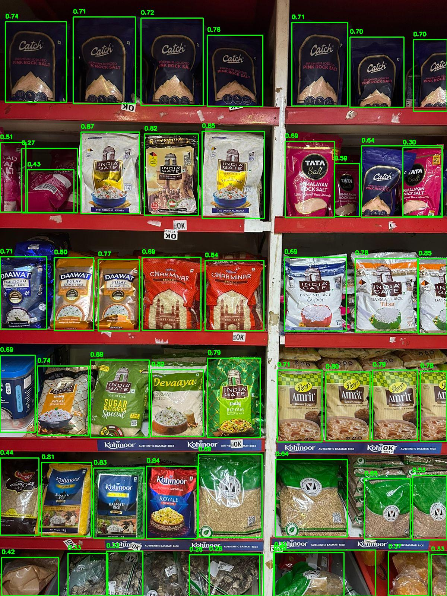

# Smart Product Detection System

- We started with using yolov5 with large parameters but then switched to `yolov11nano` for faster inference time
- We used `yolov11nano` model to segment products from the shelf image into images of each product
- Results from `yolov11nano`:
  
  
  
- After getting the bounding boxes on the products, we cropped them and fed the images to `GEMINI API` with propmts for it to identify the product in the image
- Made calls to the model and the api using flask and the results are as follows: 


# Setting up Locally

## Prerequisites
- Python 3.8+
- Node.js 16+
- Docker and Docker Compose
- Google Gemini API key

## Environment Setup
1. Clone the repository
```bash
git clone https://github.com/
cd cloned-repo
```

2. Create environment files:
Create a `.env` file in the root directory with the following variables:
```
GEMINI_API_KEY=your_gemini_api_key
POSTGRES_USER=kestra
POSTGRES_PASSWORD=your_db_password
POSTGRES_DB=kestra
KESTRA_ADMIN_PASSWORD=your_admin_password
```

3. Install dependencies:
```bash
# Frontend setup
cd frontend
npm install

# Backend setup
cd ../backend
pip install -r requirements.txt
```

## Running the Application

1. Start the Kestra workflow engine:
```bash
docker-compose up -d
```

2. Start the frontend (in the frontend directory):
```bash
npm run dev
```

3. Start the backend (in the backend directory):
```bash
python app.py
```

The application will be available at:
- Frontend: http://localhost:5173
- Backend API: http://localhost:5000
- Kestra Dashboard: http://localhost:8080 (username: admin, password: as set in .env)

# Tech Stack
- Frontend: React.js with Tailwind CSS
- Backend: Flask REST API
- ML Model: YOLO v11nano for object detection
- AI: Gemini 1.5 flash (8B parameters) for product recognition
- Workflow Engine: Kestra for task orchestration
- Database: PostgreSQL for workflow state management

## Model Performance
YOLO v11nano provides fast and accurate object detection:


# Project Structure
```
.
├── backend/           # Flask backend
├── frontend/         # React frontend
├── config/           # Configuration files
├── workflows/        # Kestra workflow definitions
└── docker-compose.yml
```

# Contributing
1. Fork the repository
2. Create a feature branch
3. Commit your changes
4. Push to the branch
5. Create a Pull Request

# License
This project is licensed under the MIT License - see the LICENSE file for details.
